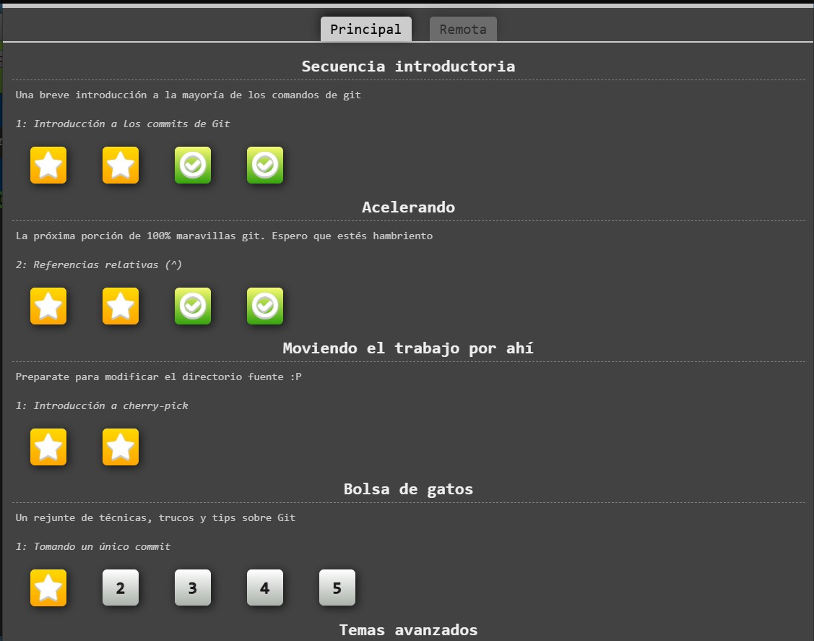
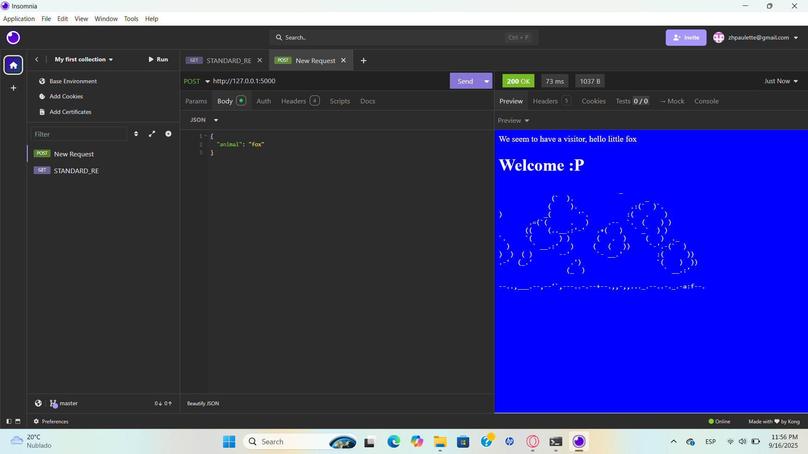
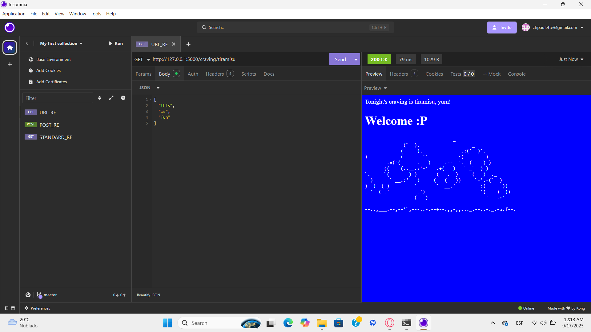

# Laboratorio 2: Github e Inicialización del Proyecto
## Parte 1

### Mini cuestionario

1. Quieres combinar múltiples commits pequeños en uno solo para dejar el historial más
limpio, antes de enviar al remoto. ¿Qué comando se utiliza?

    > b) git rebase -i

2. Hiciste un commit con un mensaje incorrecto y aún no lo has enviado al repositorio remoto.
¿Cuál es el comando correcto para modificar el mensaje del último commit?

    > c) git commit --amend

3. Subiste un commit al repositorio remoto con un error y necesitas deshacerlo creando un
nuevo commit que revierta los cambios. ¿Qué comando usarías?

    > b) git revert HEAD

4. Brevemente indique, ¿cuál es la diferencia principal entre git clone y git fork en GitHub?

    > Git fork es esencialmente una copia independiente del repositorio original, los cambios hechos a la copia no afectan al original. En git clone al contrario, los cambios que hacen localmente pueden modificar el repositorio original. 

## Parte 2

### Screenshots de la mini app

1. Un mensaje cualquiera para el GET al root path: / .

2. Un mensaje que consuma una propiedad del request de un POST al root path: / .

3. Un mensaje mostrando un valor que venga en el URL.

## Pregunta final

¿Es fácil integrar un ambiente para pruebas unitarias?. De forma breve, ¿Cómo sería?

> En el caso de Flask, este cuenta con un cliente de pruebas. Su funcionamiento es parecido a Insomnia ya que, simula peticiones y devuelve los datos de respuesta. Para armar las pruebas se necesita pytest y coverage. Las pruebas definidas en el código se estructuran en módulos de Python que contienen pruebas unitarias. 

